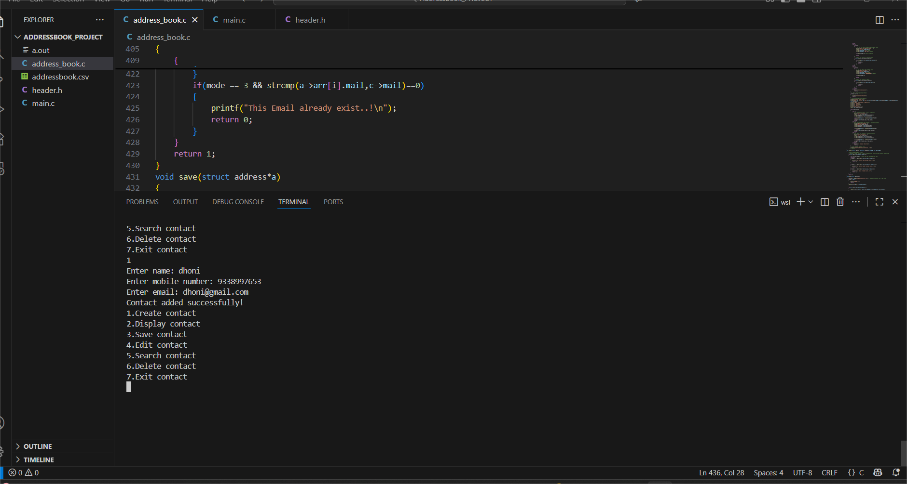
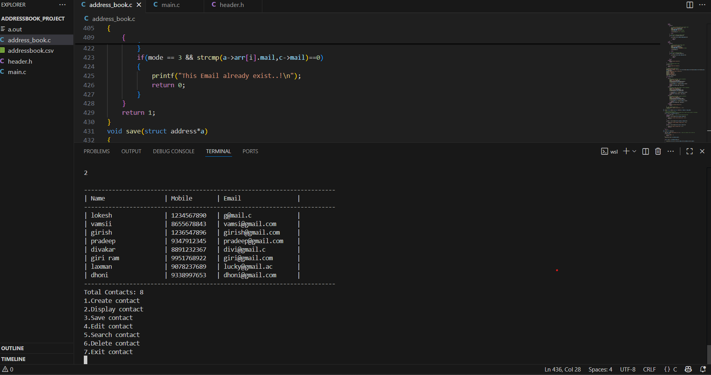
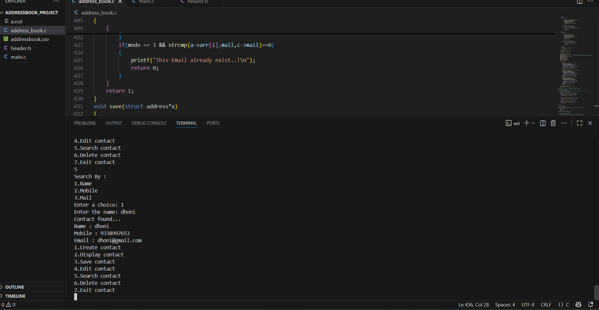

# 📘 Address Book Management System (C Project)

### 👨‍💻 Developed by: Gavara Girish 
### 🗓️ Date: 29/10/2025

---

## 💡 Project Overview
The **Address Book Management System** is a C-based console application designed to manage and organize contact information efficiently.  
It supports creating, displaying, searching, editing, deleting, saving, and loading contacts, ensuring smooth contact management with data persistence.

---

## 🧩 Features
- ➕ **Add New Contact** – with input validation  
- 🔍 **Search Contact** – by name, mobile, or email  
- ✏️ **Edit Contact** – modify details while maintaining uniqueness  
- ❌ **Delete Contact** – remove a specific contact safely  
- 💾 **Save and Load Contacts** – using text (CSV) files for persistence  
- ⚙️ **Validation System** – ensures correct name, mobile number, and email formats  
- 🔐 **Uniqueness Check** – prevents duplicate records  

---

## 🧱 Tech Stack
- Language: **C**
- Concepts Used:
  - Structures (`struct`)
  - File Handling (`fopen`, `fprintf`, `fscanf`)
  - Input Validation
  - Modular Programming (`.h` and `.c` files)
  - String Operations

---

## 🧠 Learning Outcomes
- Gained hands-on experience in **C file handling**
- Learned **data persistence and structured storage**
- Improved **modular coding and validation logic**
- Developed debugging and problem-solving skills

---

---

## 📸 Output Preview

### 🖥️ Main Menu

### ➕ Adding a Contact

### 📋 Displaying Contacts

### 🔍 Searching Contact

---

## 🗂️ File Structure
